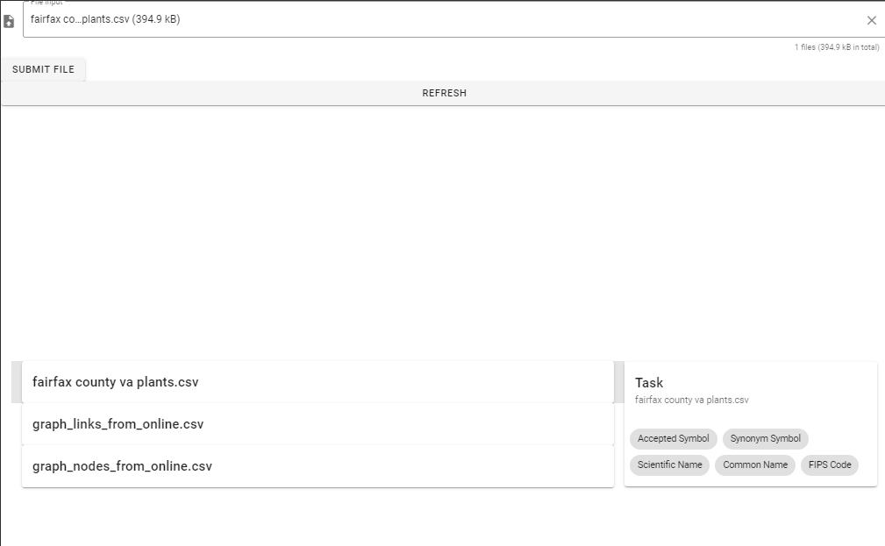

# self-service-analysis-platform
sketches related to a standalone self-service data analysis platform.

VueJS (2) / Python (3.6 +, FastAPI) 

At the moment, the web app looks like this. It gets the job done for now.



And the `/listuploadedfiles/` command returns something like this (varies depending on your files):
```
{"files":[
  {
    "filename":"fairfax county va plants.csv",
    "columns":[{"colname":"Accepted Symbol","colkey":"e2e_data\\fairfax county va plants.csv0","dtype":"object"},{"colname":"Synonym Symbol","colkey":"e2e_data\\fairfax county va plants.csv1","dtype":"object"},{"colname":"Scientific Name","colkey":"e2e_data\\fairfax county va plants.csv2","dtype":"object"},{"colname":"Common Name","colkey":"e2e_data\\fairfax county va plants.csv3","dtype":"object"},{"colname":"FIPS Code","colkey":"e2e_data\\fairfax county va plants.csv4","dtype":"object"}],
    "filekey":0
  },
  {
    "filename":"graph_links_from_online.csv",
    "columns":[{"colname":"fName","colkey":"e2e_data\\graph_links_from_online.csv0","dtype":"object"},{"colname":"lName","colkey":"e2e_data\\graph_links_from_online.csv1","dtype":"object"},{"colname":"sexAtBirth","colkey":"e2e_data\\graph_links_from_online.csv2","dtype":"object"},{"colname":"birthPlace","colkey":"e2e_data\\graph_links_from_online.csv3","dtype":"object"},{"colname":"deathDate","colkey":"e2e_data\\graph_links_from_online.csv4","dtype":"object"},{"colname":"approxDate","colkey":"e2e_data\\graph_links_from_online.csv5","dtype":"object"},{"colname":"deathPlace","colkey":"e2e_data\\graph_links_from_online.csv6","dtype":"object"},{"colname":"id","colkey":"e2e_data\\graph_links_from_online.csv7","dtype":"object"},{"colname":"index","colkey":"e2e_data\\graph_links_from_online.csv8","dtype":"int64"},{"colname":"x","colkey":"e2e_data\\graph_links_from_online.csv9","dtype":"float64"},{"colname":"y","colkey":"e2e_data\\graph_links_from_online.csv10","dtype":"float64"},{"colname":"vy","colkey":"e2e_data\\graph_links_from_online.csv11","dtype":"float64"},{"colname":"vx","colkey":"e2e_data\\graph_links_from_online.csv12","dtype":"float64"},{"colname":"key","colkey":"e2e_data\\graph_links_from_online.csv13","dtype":"int64"},{"colname":"type","colkey":"e2e_data\\graph_links_from_online.csv14","dtype":"object"}],
    "filekey":1
  },
  {
    "filename":"graph_nodes_from_online.csv",
    "columns":[{"colname":"fName","colkey":"e2e_data\\graph_nodes_from_online.csv0","dtype":"object"},{"colname":"lName","colkey":"e2e_data\\graph_nodes_from_online.csv1","dtype":"object"},{"colname":"sexAtBirth","colkey":"e2e_data\\graph_nodes_from_online.csv2","dtype":"object"},{"colname":"birthPlace","colkey":"e2e_data\\graph_nodes_from_online.csv3","dtype":"object"},{"colname":"deathDate","colkey":"e2e_data\\graph_nodes_from_online.csv4","dtype":"object"},{"colname":"approxDate","colkey":"e2e_data\\graph_nodes_from_online.csv5","dtype":"object"},{"colname":"deathPlace","colkey":"e2e_data\\graph_nodes_from_online.csv6","dtype":"object"},{"colname":"id","colkey":"e2e_data\\graph_nodes_from_online.csv7","dtype":"object"},{"colname":"index","colkey":"e2e_data\\graph_nodes_from_online.csv8","dtype":"int64"},{"colname":"x","colkey":"e2e_data\\graph_nodes_from_online.csv9","dtype":"float64"},{"colname":"y","colkey":"e2e_data\\graph_nodes_from_online.csv10","dtype":"float64"},{"colname":"vy","colkey":"e2e_data\\graph_nodes_from_online.csv11","dtype":"float64"},{"colname":"vx","colkey":"e2e_data\\graph_nodes_from_online.csv12","dtype":"float64"}],
    "filekey":2
  }
]}
```

[This codepen](https://codepen.io/ejaffe/pen/YzQXare) will not work without downloading and standing up api.py on your local machine. But you can try it out for yourself if you do.


Left to do:
 - [x] Make the upload function work
 - [x] Make the download function work
 - [x] make the list function work
 - [ ] Add auth via PKI and secure CORS if neccesary
 - [ ] Make the back-end make more sense for the front-end
 - [ ] Add user-files relationship
 - [ ] manage files
 
 - [ ] Make the actual task run request interface
 - [ ] Add python code to do tasks
 - [ ] Robust activity logging
